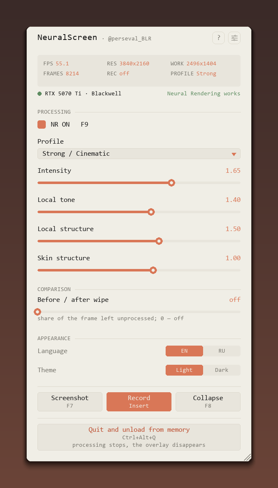
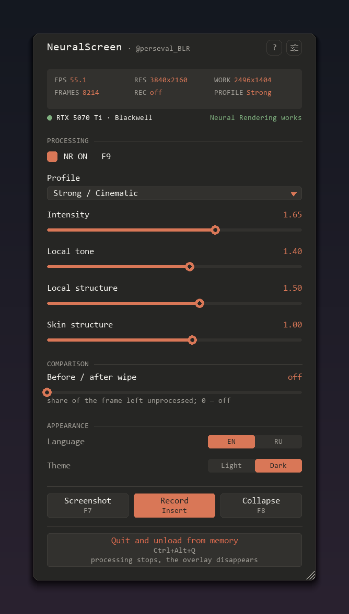
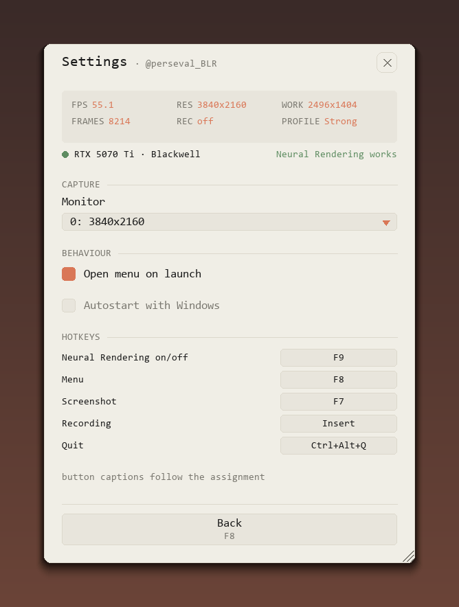

# NeuralScreen — DLSS 5 Neural Rendering на весь рабочий стол Windows

**NVIDIA DLSS 5 Neural Rendering (NGX Feature 18) на всём рабочем столе
Windows в реальном времени.** Экран захватывается, прогоняется через тот же
нейронный рендерер, что используют игры с DLSS 5, и рисуется обратно
оверлеем, прозрачным для кликов. RTX 20/30/40/50 — см. «Старые GPU» ниже.

<table>
<tr>
<td></td>
<td></td>
</tr>
</table>

Всё собрано в одно меню внутри оверлея: `F8` открывает его, и пока оно
открыто, оверлей забирает мышь и клавиатуру — меню работает поверх игры.
Точка рядом с названием карты зелёная, когда Neural Rendering реально
работает на этой карте, красная — когда нет.

```
захват экрана -> motion guides -> NGX-воркер (D3D12) -> оверлей на весь экран
  в воркере        cv2 DIS 320x180     native/nvngx.dll      окно воркера + меню
```

> **v1.1.** Весь конвейер на GPU — захват, нейронный проход и вывод внутри
> воркера; Python считает только guides оптического потока (0.1 мс/кадр).
> RTX 5070 Ti, work на потолке 2560×1440: **47 FPS с NR на рабочем столе 4K,
> 102 FPS на 2560×1600**. NGX evaluate занимает 15.7 и 8.0 мс соответственно —
> он масштабируется с разрешением **экрана**, а вся остальная обвязка стоит
> около 2 мс в любом случае (таймстемпы D3D12 на очереди).

## Требования

- **Windows 11** (нужен Desktop Duplication API и `WDA_EXCLUDEFROMCAPTURE`)
- **NVIDIA RTX 50-серии** для официально поддерживаемого пути. Разработано и
  проверено на RTX 5070 Ti, драйвер 616.56. Для 20/30/40-серий см. «Старые
  GPU» ниже — ядра там есть, отказ — это проверка политики, а не отсутствие кода
- В архиве релиза — **портативный Python-рантайм** (встроенный CPython 3.13 +
  PyAV + OpenCV + pygame). Устанавливать Python не нужно.
- **`native/nvngx_dlssnr.dll`** — рантайм NVIDIA (165 МБ). В репозитории его
  нет (лимит GitHub 100 МБ) — взять из ассетов релиза и положить в `native/`.

## Запуск

1. Скачать архив релиза и распаковать куда угодно.
2. Положить `native/nvngx_dlssnr.dll` из ассетов релиза в `native/`
   (или по инструкции в README, раздел «Требования»).
3. Двойной клик по **`NeuralScreen.vbs`** — консольных окон нет. Приложение
   живёт в трее, лог пишется в `NeuralScreen.log`.
4. `NeuralScreen.bat` — отладочный лаунчер с консолью (FPS и тайминги
   в реальном времени), если нужно.

> Внимание, анти-чит: процесс с именем `nvngx.dll` плюс полноэкранный оверлей
> могут не понравиться EAC/BattlEye/Vanguard. Не запускайте NeuralScreen в
> соревновательных онлайн-играх.

## Управление

| Клавиша | Действие |
|---|---|
| `F9` | NR вкл/выкл. **Выкл — это bypass**: оверлей остаётся на экране (сырой захват, без эффекта), рабочий стол работает быстрее. Всё прячется только при настоящем выходе. |
| `F8` | открыть/закрыть меню. Пока оно открыто, оверлей забирает мышь и клавиатуру — меню работает поверх игры; закрытое, оно снова сквозное, и рабочий стол ведёт себя как обычно. |
| `F7` | скриншот — открывает нативный диалог «Сохранить как» (JPEG 100%). Диалог живёт в своём потоке, поэтому конвейер не встаёт, пока выбираете имя |
| `Insert` | старт/стоп записи видео (MP4, AV1 NVENC, 60 кадров/с, ~64 Мбит/с). Есть и кнопка **Запись** в меню |
| `Ctrl+Alt+↑` / `Ctrl+Alt+↓` | масштаб обработки ±0.05 |
| `Ctrl+Alt+Q` | выход |

Клавиши переназначаются **из меню**: шестерёнка → «Горячие клавиши» → клик
по полю → нажать комбинацию. Пока поле ждёт нажатие, глобальные хоткеи
снимаются — иначе `F8` переключил бы меню вместо того, чтобы попасть в поле;
`Esc` отменяет. Назначение сразу пишется в `config.json`, и все подписи на
кнопках меню меняются вместе с ним.

Можно и руками: `"hotkeys": {"toggle": "F9", "record": "Insert", ...}` (команды: `toggle`, `settings`, `screenshot_menu`, `record`, `scale_up`, `scale_down`, `quit`; клавиши: F1–F12, буквы, цифры, Insert/Delete/Home/End/PgUp/PgDn/стрелки, модификаторы Ctrl/Alt/Shift).

Хоткеи регистрируются через `RegisterHotKey`, а не опрашиваются: система
доставляет нажатие **только нам и не передаёт активному приложению** — F9
в игре переключает NR, и сама игра этой клавиши не видит. Обратная сторона:
пока NeuralScreen запущен, F7, F8, F9 и Insert принадлежат ему.

Иконка в трее: левый клик открывает то же меню, правый — NR вкл/выкл,
масштаб, выход.

**Меню** живёт внутри самого оверлея, отдельного окна настроек больше нет.
Оно было вторым интерфейсом к тем же значениям, воровало фокус у игры и
тянуло за собой весь tcl/tk в runtime.

На основной странице то, что трогают в течение сеанса, разбитое на блоки:

- **состояние** — живые показания (FPS, разрешение, work-размер, кадры,
  время записи) и строка с картой, её архитектурой и точкой: зелёная, когда
  Neural Rendering на этой карте реально работает, красная — когда нет.
  Точка идёт от ответа воркера, а не от архитектуры: наверняка это знает
  только `CreateFeature`
- **обработка** — NR вкл/выкл со своей клавишей, профиль (Faithful /
  Natural / Strong / Extreme) и четыре параметра NR
- **сравнение** — шторка «до/после»
- **вид** — язык и тема переключателями, а не выпадающими списками: список
  ради двух значений это лишний клик и лишняя механика

В подвале «Скриншот», «Запись» и «Свернуть», у каждой подпись клавиши под
названием, а под разделителем одна широкая строка: **«Выйти и выгрузить из
памяти»** — с клавишей и пояснением, что обработка остановится и оверлей
исчезнет. Крестика в шапке нет намеренно: он стоял рядом с выходом из
программы, и два действия с совершенно разными последствиями выглядели
одинаково безобидно.

В шапке две кнопки: **?** открывает эту страницу, а иконка ползунков —
страницу настроек: монитор, «открывать меню при запуске», автозапуск с
Windows и переназначение клавиш. То, что трогают один раз, не мешается под
руками.

<table>
<tr>
<td></td>
<td></td>
</tr>
</table>

Панель таскается за заголовок, растягивается за правый нижний угол, а за
нижнюю кромку задаётся высота — все три зоны подсвечиваются при наведении и
все запоминаются в `config.json` (`menu_offset`, `menu_scale`,
`menu_height`). Что не влезло в заданную высоту — прокручивается, полоса у
правого края появляется только когда есть куда скроллить.

При запуске меню открывается само. NeuralScreen рисует поверх рабочего стола
и никак иначе себя не проявляет — без этого непонятно, запустился он или
нет. Выключите переключатель, и вместо меню будет короткий алерт.

**Три способа закрыть программу** (делают разное, названы по-разному):

| | Что делает |
|---|---|
| `Ctrl+Alt+Q`, «Выйти и выгрузить из памяти» в меню, «Выход» в трее | завершают программу: воркер погашен, окна закрыты, процессов не остаётся |
| «Свернуть» в меню, `F8`, `Esc` | только прячут меню, программа продолжает работать |

## Запись (Insert)

`Insert` запускает/останавливает запись **кадров после нейронной обработки**
в `recordings/neuralscreen-<timestamp>.mp4`:

- Аппаратный AV1 NVENC в разрешении рабочего стола, **60 кадров/с**,
  VBR с целевым качеством (`cq 16`, на практике ~64 Мбит/с, потолок
  250 Мбит/с), пресет p6 + tune hq, цветовые теги sRGB/BT.709 (метаданные
  прописаны и на потоке, и на каждом кадре — плееры показывают цвета 1-в-1
  как на экране).
- Битрейт здесь **потолок, а не цель**: на резком движении кодеру разрешено
  потратить больше, вместо того чтобы ронять качество ради попадания в
  цифру. Качество при этом не стоит времени кодирования — оно упирается в
  конверсию цвета, а не в пресет (замерено: 1.6–1.7 с на 3 с видео при любых
  испробованных настройках).
- Запись идёт на **60 кадрах/с**, потому что конвейер выдаёт ~55 кадров в
  секунду. Прежняя таймбаза 1/30 их просто не вмещала: кадры впихивались
  вдвое меньшее число тиков — вот от чего движение разваливалось, а вовсе
  не от битрейта.
- **В запись попадает только открытое меню**, больше ничего. Наш слой скрыт
  от внешнего захвата, поэтому всё, что должно оказаться в файле, рисуется
  поверх кадра перед кодированием. То же и со скриншотами. Раньше запекались
  HUD-панель и водяной знак; с экрана они убраны, а в файле выглядели как
  чужая подпись.
- Запись работает и в NR ON, и в NR OFF (bypass); длительность файла
  совпадает с реальным временем (PTS строится от часов).

### Сколько стоит запись и почему дело не в битрейте

Запись роняла частоту кадров вдвое. Замер на 4K с `NS_PHASE=1`, на кадр:

```
                     без записи   с записью   после обеих правок
кадров в секунду        55.7        20.6           30.1
recv                    17.5        31.6           24.5 мс
кодирование (Python)     0.4        19.9            3.1 мс
кадр воркера            17.4        24.1           21.3 мс
```

Две статьи расхода, и ни одна из них не битрейт:

- **19.9 мс на перевод RGBA→yuv420p на CPU** плюс отправка в nvenc, прямо
  в цикле захвата. Теперь кодирование идёт в своём потоке за очередью на
  четыре слота, а цикл только считает PTS и отдаёт кадр. При переполнении
  очереди кадр выбрасывается, а не тормозит цикл: пользователь смотрит на
  экран, а не в файл, и пропуск не сдвигает время — PTS берётся от часов.
- **~7 мс на прогон 33 МБ через пайп.** Канал `OUTS` вместо этого даёт
  воркеру именованную секцию, куда он кладёт пиксели. Копия из секции
  делается в потоке читателя; без копии не обойтись — слот один, и воркер
  перепишет его следующим кадром, а кадр записи живёт дольше.

Снижение битрейта не трогает ни то, ни другое: время уходит в цветовое
преобразование, а не в кодер. Поэтому ползунка битрейта в меню и нет — это
была бы ручка, которая выглядит полезной и ничего не делает.

## config.json

| Поле | Смысл |
|---|---|
| `monitor` | индекс монитора для захвата |
| `width`, `height` | разрешение вывода (**реальное разрешение монитора берётся автоматически, если конфиг устарел**) |
| `fullscreen` | безрамочное окно на весь монитор |
| `warmup` | прогревочные кадры NGX при старте |
| `work_scale` | 0.25–1.0, разрешение обработки NGX относительно вывода. **Поднимать бесплатно** — см. Производительность |
| `profile` | `Faithful`, `Natural`, `Strong / Cinematic`, `Extreme / Overdrive` |
| `intensity`, `local_tone`, `local_structure`, `skin_structure` | `null` = взять из профиля |
| `lang` | `ru` / `en` |
| `worker_present` | воркер показывает кадр в своём окне (`false` — вывод через pygame) |
| `motion_on_gpu` | поле движения растягивает воркер (`false` — считать на CPU) |
| `capture_in_worker` | воркер захватывает экран сам (DDA; `false` — dxcam в Python) |
| `pixels_in_shm` | пиксели результата возвращаются через общую секцию, а не через пайп (`false` — пайп, как раньше) |
| `split` | 0–1, доля кадра без обработки для шторки «до/после»; 0 — выключено |
| `theme` | `light` / `dark` |
| `open_menu_on_start` | открывать меню при запуске; `false` — вместо него короткий алерт |
| `hotkeys` | `{"toggle": "F9", ...}` — см. «Управление» |
| `menu_offset`, `menu_scale`, `menu_height` | где стоит меню, его масштаб и высота. Пишет программа, руками править не нужно (`menu_height: null` — по содержимому) |

## Архитектура

Два процесса. Python ведёт настройки, guides оптического потока и слой меню;
C++-воркер владеет D3D12-устройством, захватом, NGX и окном оверлея.
Общаются через stdin/stdout бинарным протоколом:

| Сообщение | Назначение |
|---|---|
| `D5V3` | заголовок потока: размеры, профиль, параметры NR |
| `SHMI` / `SACK` | имя общей памяти под входной кадр |
| `WNDO` / `WACK` | поднять/закрыть окно вывода воркера |
| `MOTS` / `MACK` | поле движения приходит уменьшенным, растягивает воркер на GPU |
| `DDA1` / `DACK` | воркер забирает захват (Desktop Duplication), цвет не касается CPU |
| `GRAY` / `GAK` | воркер пишет AREA-luminance (320×180) в обратный маппинг для guides |
| `FRM1` | кадр: заголовок, дальше либо тело (RGBA8 + motion), либо флаг «в общей памяти» |
| `OUT1` | результат: RGBA8 full-res, либо `bytes=0` — кадр уже показал воркер |
| `RNSZ` / `RACK` | смена work-разрешения на лету, без рестарта процесса |
| `OUTS` / `OAK2` | секция, в которую воркер кладёт пиксели результата; в ответе тогда `bytes = 0xFFFFFFFF` вместо тела |

**Захват.** По команде `DDA1` воркер открывает Desktop Duplication на GPU:
кадр копируется в кросс-устройственную shared-текстуру и своппится в RGBA.
Python вообще перестаёт захватывать — `grab` и `guides` падают до 0.1 мс.
Фолбэк (dxcam + передача кадра целиком) остался нетронутым.

**Guides.** Оптическому потоку нужен маленький серый кадр. По `GRAY` воркер
считает его честным блочным усреднением (блок 12×12 при 4K → 320×180, как
`cv2.INTER_AREA`; билинейная выборка дала бы алиасинг на тексте) и пишет в
именованный маппинг. Полный кадр больше не пересекает CPU.

**Вывод.** По `WNDO` воркер поднимает своё безрамочное окно на весь экран с
D3D12-swapchain и показывает результат NGX сам: пиксели в Python не
возвращаются. Окно pygame остаётся слоем меню — фон заливается цветом-ключом
и делается прозрачным (`LWA_COLORKEY`). Пока меню открыто, глобальная альфа
окна (`LWA_ALPHA`) поднимается до 255: иначе яркий кадр снизу просвечивает
сквозь панель.

**NR off (bypass).** `F9` больше не останавливает конвейер. Кадры уходят с
флагом `FRAME_FLAG_BYPASS`: воркер пропускает NGX evaluate и показывает сырой
захват. Оверлей остаётся живым; всё прячется только при настоящем выходе.

**Запись.** Кадры запрашиваются у воркера флагом `FRAME_FLAG_WANT_PIXELS`
(тот же механизм, что для скриншота); открытое меню рисуется поверх кадра
(`draw_capture_overlay`), затем PyAV кодирует AV1 NVENC.

Два ограничения, которые выглядят как странности, но обязательны:

- **Имя воркера обязано быть `nvngx.dll`.** NGX Core возвращает
  `FAIL_PlatformError` на `Init_Ext` для любого другого имени процесса.
  Проверено экспериментально.
- **work-разрешение ограничено 2560×1440.** На 4K feature 18 молчит: воркер
  зависает на нулевом кадре и в legacy-, и в upscale-режиме.

Смена масштаба идёт через `RNSZ` (~60 мс, воркер пересоздаёт NGX feature у
себя). Если `RNSZ` не прошёл — фолбэк на полный рестарт воркера.

## Производительность

Замерено на RTX 5070 Ti, рабочий стол 4K, `work_scale` 0.5 (1920×1080),
конвейер полностью на GPU (DDA + GRAY + WNDO + MOTS). Разбор фаз на стороне
воркера (включается переменной `NS_PHASE=1`):

```
                 acq   dda  upload   eval  present   frame     FPS
NR ON            0.0   0.7     0.1   16.6      0.5    17.9      55
NR OFF (bypass)  ~3    ~4      0.1      -      ~3      7.3  121-133
```

**Собственно NGX — 16.6 мс, то есть 93% кадра в режиме NR.** Всё остальное
вместе стоит 1.3 мс, так что практический потолок на этом железе определяется
NGX, а не обвязкой. В bypass NGX пропускается, и цикл честно ждёт изменений
рабочего стола (`acq`) — отсюда кратно больший FPS.

В прежней редакции этого раздела было написано «NGX — около 1 мс». Это была
ошибка измерения: цифра получена регрессией времени ответа по work-разрешению,
а такая регрессия видит только зависящую от разрешения часть (0.46 мс/МПикс).
Большую постоянную составляющую NGX она не увидела и отнесла к транспорту.

Опубликованные ранее цифры для 1440p (64 FPS) сняты до исправления ожидания
забора DDA и занижают текущую производительность; заново не мерились.

### work_scale ничего не стоит

Время работы NGX не зависит от work-разрешения вообще. Замерено по всему
диапазону слайдера на рабочем столе 4K:

```
work          МПикс   eval мс    FPS
960x540       0.52     16.13    53.8
1344x756      1.02     15.90    55.4
1728x972      1.68     15.93    56.8
2112x1188     2.51     15.96    55.7
2496x1404     3.50     15.98    55.3
```

Подгонка: `eval = 15.97 мс + (-0.01) мс/МПикс`, R² = 0.011 — то есть шум, а
не зависимость. Семикратный рост числа входных пикселей стоит 0.2 мс, что
укладывается в разброс самого замера.

**Поэтому слайдер стоит держать на максимуме.** Понижение `work_scale` не
даёт никакого выигрыша по скорости и только снижает чёткость; по умолчанию
теперь 1.0. Это безопасно на любом мониторе: work-размер всё равно зажат
потолком NGX 2560×1440, поэтому ползунок всегда попадает ровно в потолок —
2560×1440 с рабочего стола 4K, 2304×1440 с 2560×1600. Прежнее значение 0.65
подбиралось так, чтобы встать чуть ниже потолка **на 4K**, а на экранах меньше
оно молча выбрасывало разрешение.

Перепроверено таймстемпами D3D12 на очереди, то есть GPU-временем внутри
`Evaluate`, а не временем вокруг submit, на двух разрешениях рабочего стола:

```
рабочий стол   диапазон work_scale   work МПикс     eval на GPU
2560x1600      0.30 .. 1.00          0.37 .. 3.32   7.9 - 8.6 мс
3840x2160      0.30 .. 1.00          0.75 .. 3.69   15.70 - 15.73 мс
```

Пикселей в work в пять-девять раз больше при том же времени — на обоих
разрешениях. Это регулятор качества, а не компромисс качества со скоростью.

### ...а вот разрешение экрана — да

Две строки выше различаются в 2.02 раза по пикселям экрана и в 1.96 раза по
времени eval. В этом и весь ответ: в upscale-режиме NGX получает **полный**
кадр и возвращает полный, ужимая до work-размера внутри себя. Цену задаёт
рабочий стол, а не ползунок.

Прежняя редакция этого раздела заключала, что «модель считает на своём
фиксированном внутреннем разрешении». Это неверно, и ошибка поучительная:
вывод строился на варьировании одного `work_scale` при неизменном разрешении
экрана, а такой замер по построению не может увидеть зависимость от размера
кадра.

Следствия: на рабочем столе 4K нижняя граница — 15.7 мс NGX на кадр, то есть
около 57 FPS со стороны воркера и 47 сквозных, и никакая работа над обвязкой
не приблизит к панели на 144 Гц. На 2560×1600 та же граница — 8.0 мс. Нужно
больше кадров — снижать надо **разрешение экрана**, ползунок work этого не
сделает.

## Шторка «до / после»

Слайдер **«Шторка до / после»** оставляет левую долю кадра необработанной —
сырой захват и результат NGX стоят рядом, разделённые акцентной линией.
0 — выключено.

Делается в воркере, на GPU: один `CopyTextureRegion` левой полосы входа
поверх выхода, затем разделитель через `ClearUnorderedAccessViewFloat` с
прямоугольником. Оба шага — до Present и до отдачи пикселей, поэтому шторка
сама попадает в записи и скриншоты. Позиция едет в старших 16 битах поля
флагов заголовка кадра — движение слайдера не пересоздаёт воркер.

## Старые GPU (20/30/40-серии)

`nvngx_dlssnr.dll` отказывается создавать feature на всём, что ниже
Blackwell. В его собственных ресурсах версии написано
`NGXGpuArchitecture = NVSDK_NGX_GPU_Arch_Blackwell2`, и в нём есть сообщение

```
DLSSNR: Unsupported GPU architecture 0x%x, minimum required 0x%x
```

Но скомпилированные ядра для старых карт **в файле есть**. Разбор заголовков
fatbin: все пятнадцать fatbin'ов несут `sm_75` (Turing), `sm_86` (Ampere),
`sm_89` (Ada) и `sm_120` (Blackwell), без пропусков. То есть отказ — это
проверка политики, а не отсутствие кода.

Библиотека узнаёт архитектуру через nvapi — грузит `nvapi64.dll`, берёт его
единственный экспорт `nvapi_QueryInterface` и спрашивает
`NvAPI_GPU_GetArchInfo` по id. Воркер патчит эту одну функцию **в памяти
своего процесса** при старте: пролог сохраняется, заменяется прыжком на наш
обработчик и восстанавливается вокруг каждого реального вызова — любой
хендл GPU по-прежнему обслуживает родной код NVIDIA, переписывается только
возвращаемая архитектура (на Blackwell). Файлы NVIDIA не модифицируются, а
на 50-серии хук сам себя отключает и ничего не делает.

**Включено по умолчанию** (`NS_ARCH_SPOOF=0` — выключить). **Не проверено
на реальном железе 20/30/40-серий** — здесь только 5070 Ti, где хук по
построению no-op. Точка GPU в меню говорит правду в любом случае: она
зеленеет только когда воркер реально создал feature 18, а не когда
архитектура просто выглядит правильно.

Это, скорее всего, расходится с условиями лицензии на редистрибутив NVIDIA.
Никакую защиту это не снимает и файлы не меняет, но включать его — твоё
решение.

## Ограничения (прочти до записи ролика)

1. **Полноэкранные эксклюзивные игры НЕ покрываются.** Windows физически не
   рисует никакие окна поверх exclusive-fullscreen-поверхности — это
   ограничение ОС, не баг приложения. Тестируйте в **безрамочном оконном**
   режиме (есть в любой современной игре). Проверено: RealRTCW (оконный) —
   работает; F.E.A.R. (LithTech d3d8, форсит exclusive при загрузке уровня) —
   оверлей невидим в геймплее, в меню виден.
2. **Внешние рекордеры (OBS, ShadowPlay, Lightshot) НЕ захватывают оверлей.**
   Окна оверлея исключены из захвата (`WDA_EXCLUDEFROMCAPTURE`), чтобы DDA-
   конвейер не снимал сам себя. NVIDIA App может даже отказаться записывать
   рабочий стол, пока работает NeuralScreen («Python препятствует записи
   рабочего стола»). Используйте встроенную запись **Insert** — она берёт
   реальный NR-кадр, вместе с меню, если оно открыто.
3. **work-разрешение упирается в 2560×1440** (ограничение NGX feature 18).
4. **Сквозная задержка 40–60 мс** — свойство цепочки захват → NGX → показ;
   заметна при перетаскивании окон.
5. **Анти-чит:** `nvngx.dll` + оверлей — красный флаг для EAC/BattlEye/
   Vanguard. Не запускать в соревновательных онлайн-играх.
6. **Первые секунды после переключения NR** — медленно (перекалибровка NGX:
   FPS проседает на 1–3 с, затем восстанавливается).
7. На статичном рабочем столе оптический поток отключается по порогу
   `scene_score` — motion не считается, кадры идут дешевле.

## Сборка воркера

```
native\build-host.bat
```

Нужны MSVC 2022 Build Tools по пути
`C:\Program Files (x86)\Microsoft Visual Studio\2022\BuildTools`. Скрипт
собирает `dlss5-feed-host64.cpp` в `native/nvngx.dll`, линкуясь с
`native/lib/Windows_x86_64/x64/nvsdk_ngx_d.lib`. Заголовки NGX — в
`native/include/`.

Артефакт `native/nvngx.dll` в репозиторий не кладётся.

## Лицензия

MIT. DLSS 5 Neural Rendering — торговая марка NVIDIA; NeuralScreen —
независимый инструмент с открытым кодом, не аффилирован с NVIDIA.
