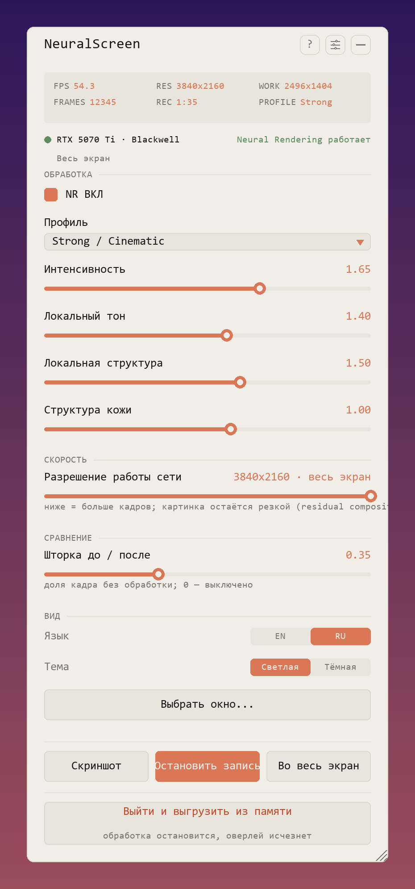
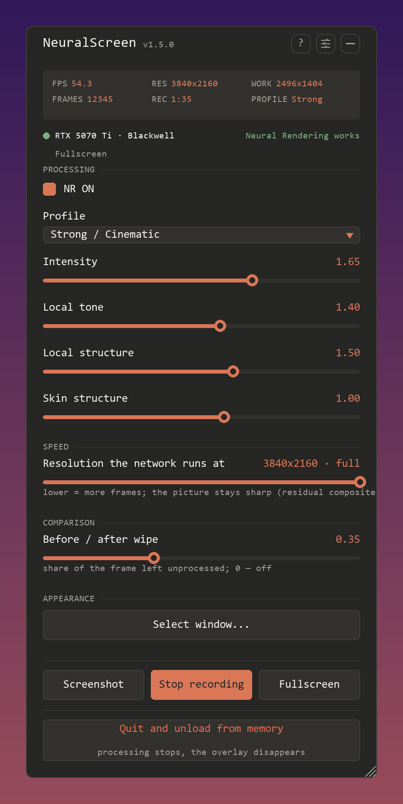
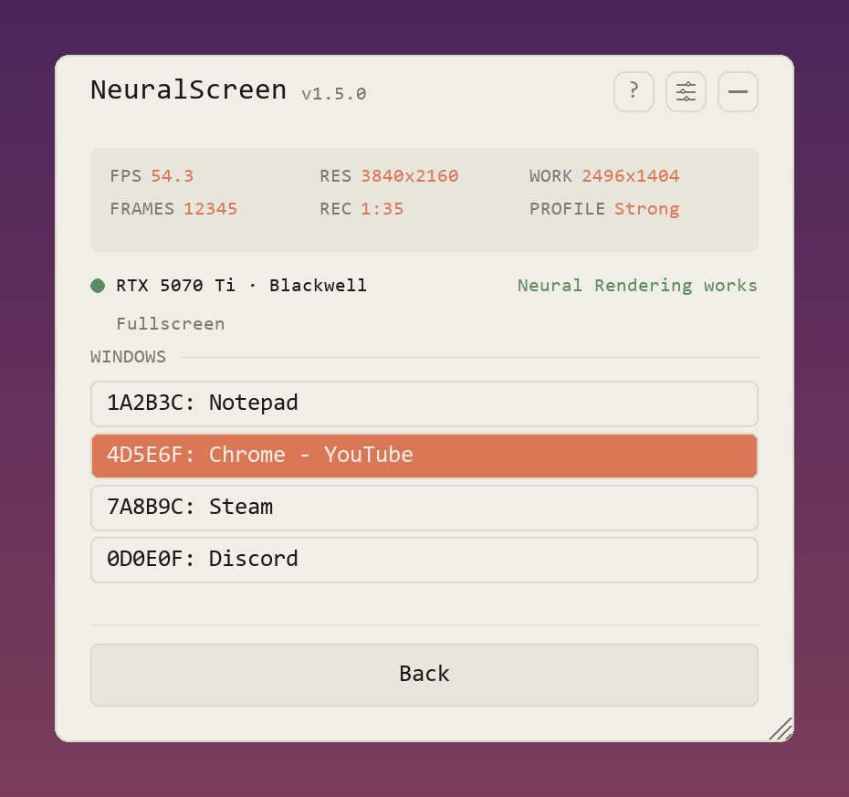
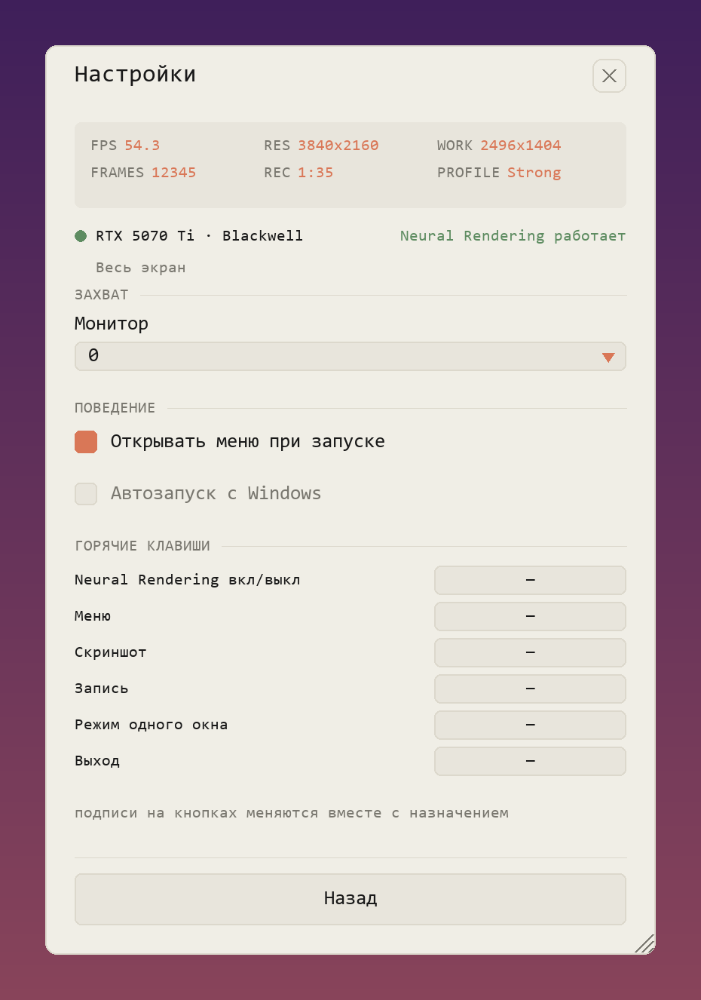

# NeuralScreen

**Нейронный рендерер NVIDIA из DLSS 5 — на весь рабочий стол Windows, в
реальном времени.** Всё, что на экране — игры, видео, фотографии — проходит
через ту же нейросеть, что работает в играх с DLSS 5, и возвращается чётче.

<table>
<tr>
<td></td>
<td></td>
</tr>
</table>

*Всё собрано в одно меню внутри оверлея. Ползунок **«Шторка до / после»**
делит экран пополам, чтобы было видно, что именно делает эффект.*

## Что нужно

- **Windows 11**
- **Видеокарта NVIDIA RTX.** Честно, что реально работает:

  | Карты | Статус |
  |---|---|
  | **RTX 50** (Blackwell) | ✅ работает - официально поддерживаемое поколение |
  | **RTX 40** (Ada) | ✅ работает - через встроенный хук архитектуры (встроенный рантайм - родная сборка NVIDIA sm_120; хук заставляет её работать на Ada) |
  | **RTX 30** (Ampere) | ❌ в этом релизе нет - нет ядер sm_86. См. «Проба на RTX 30/20» ниже. |
  | **RTX 20** (Turing) | ❌ нейропроход не может работать в принципе - ниже минимальной архитектуры (DLSS5-Feeder issue #73) |

- **Ничего устанавливать не надо.** В архиве релиза есть свой Python.

### Проба на RTX 30/20

Рантайм компилируется под каждую архитектуру отдельно. Встроенная сборка
покрывает RTX 40/50; community-сборки **310.8.SF** добавляют ядра для
RTX 30 (RTX 20 не может работать - ниже минимальной архитектуры). Чтобы
попробовать: скачайте `nvngx_dlssnr_310.8.SF-v2.zip` с
https://github.com/RankFTW/rhi-repo/releases, замените
`native\nvngx_dlssnr.dll` (сначала бэкап), запустите и посмотрите в меню:
точка у видеокарты зелёная только когда feature 18 реально создался.

**Скорость:** на RTX 30 проход медленный - единицы или до ~20 FPS в 1440p. Снизьте ползунок «Разрешение работы сети».

## Установка

1. Скачайте архив со страницы [Releases](https://github.com/perseval-BLR/DLSS5-NeuralScreen/releases)
   и распакуйте куда угодно. **Внутри уже всё есть** — включая
   `nvngx_dlssnr.dll` от NVIDIA (165 МБ, слишком большой для репозитория
   GitHub, поэтому он едет в архиве).
2. Запустите **`NeuralScreen.exe`**.

При первом запуске Windows скорее всего предупредит о неизвестном издателе —
программа не подписана платным сертификатом. Нажмите *Подробнее* → *Выполнить
в любом случае*. Не хотите — рядом лежит `NeuralScreen.vbs`, он делает то же
самое.

Установщика нет, за пределами папки ничего не создаётся. Чтобы удалить —
удалите папку.

> **Не используйте в соревновательных онлайн-играх.** Процесс с именем
> `nvngx.dll` плюс полноэкранный оверлей — ровно то, что ищут античиты.

## Как пользоваться

Программа живёт в трее и рисует поверх рабочего стола. **Num2** — меню.
Клавиши сидят на нампаде, поэтому **Num Lock должен быть включён** — с
выключенным эти клавиши посылают Insert/End/стрелки, и ничего не произойдёт.

| Клавиша | Что делает |
|---|---|
| **Num2** | открыть / закрыть меню |
| **Num1** | нейронная обработка вкл / выкл |
| **Num3** | скриншот |
| **Num0** | начать / остановить запись, со звуком |
| **Num4** / **Num6** | разрешение обработки ниже / выше |
| **Num5** | обрабатывать одно окно вместо всего экрана |
| **Ctrl+Alt+Q** | выход |

Любую клавишу можно переназначить в меню, под иконкой ползунков.

Пока меню открыто, оно забирает мышь и клавиатуру — поэтому работает поверх
игры. Закрытое, оно пропускает клики насквозь, как будто его нет.

Запуск и переключения не мигают: оверлей появляется с первым настоящим
кадром, а перестройку конвейера прикрывает короткая блур-заглушка со
спиннером.

### Одно окно вместо экрана

**Num5** наводит всё на одно окно — то, под которым сейчас курсор мыши (если
под курсором пусто — на последнее активное), — и оверлей садится на это окно
и следует за ним. **Num5** ещё раз — снова весь экран.

То же самое без хоткея: **«Выбрать окно...»** открывает список окон (при
наведении реальное окно обводится рамкой), **«Во весь экран»** внизу
возвращает захват; режим показан под строкой видеокарты.

Смысл в одном: в этом режиме **обработанную картинку видят OBS и NVIDIA App**.
В полноэкранном режиме оверлей обязан прятаться от захвата экрана, иначе
программа снимала бы собственный вывод и питалась им — а с NVIDIA App это
прятанье не просто делает оверлей невидимым, оно вообще не даёт записи
запуститься. У одного окна такой петли нет, и прятаться не от чего.

**Чтобы записать обработанную картинку через NVIDIA App:** наведите мышь на
нужное окно (игра в оконном/безрамочном режиме, браузер — что угодно),
нажмите **Num5**, затем запустите запись. Оверлей и обработанная картинка
теперь часть захвата экрана. **Num5** ещё раз — возврат на весь экран. Сам
рабочий стол окном не считается: если нажать **Num5**, наведя мышь на обои,
захватится последнее настоящее окно. Свернёте окно — обработка остановится
вместе с ним; развернёте — картинка вернётся.

## Меню

<table>
<tr>
<td></td>
<td></td>
</tr>
<tr>
<td></td>
<td></td>
</tr>
</table>

Точка рядом с названием видеокарты зелёная, когда обработка на ней реально
работает, и красная, когда нет.

Что стоит покрутить:

- **Профиль** — насколько сильный эффект, от *Faithful* до *Extreme*. Начните
  со *Strong / Cinematic*. Четыре ползунка под ним — то же самое, но в
  деталях.
- **Шторка до / после** — оставляет левую часть экрана необработанной, чтобы
  было видно, что именно делает эффект. Насмотрелись — верните на 0.
- **Разрешение работы сети** — один ползунок. В верхнем положении это весь ваш
  экран: так по умолчанию и так картинка лучше всего. Каждый шаг вниз отдаёт
  сети кадр поменьше: при выключенном ползунке сеть уже работает на максимуме,
  а каждый шаг вниз даёт **примерно на 50% больше кадров** на 2560×1440 при 4K
  экране. Картинка при этом остаётся резкой: результат сети ложится на
  исходный кадр 1:1 (matched residual composite), так что текст, края и
  интерфейс сохраняют полное разрешение, а дешёвая сеть на пониженном
  разрешении занимается пересветом. Посмотрите на свой экран и выберите шаг.

Всё остальное — какой монитор, открывать ли меню при запуске, автозапуск с
Windows, назначение клавиш — за иконкой ползунков.

## Запись и скриншоты

**Num0** записывает то, что вы видите, вместе с системным звуком, в MP4 в
папке `recordings`. **Num3** сохраняет скриншот. Если меню открыто, оно попадёт
и туда, и туда — так задумано.

Запись приходится делать изнутри программы: OBS, ShadowPlay и NVIDIA App
оверлей не видят. Это намеренно — программа снимает ваш экран, чтобы его
обработать, и если бы её собственный вывод был виден захвату, она снимала бы
сама себя. В **режиме одного окна** (Num5) вход — одно окно вместо рабочего
стола, петли самозахвата нет: оверлей перестаёт прятаться от захвата, и
внешние рекордеры (OBS display capture, NVIDIA App) видят обработанную
картинку. Полноэкранный режим продолжает прятать её.

## Если что-то не работает

**После запуска ничего не появилось.** Посмотрите `NeuralScreen.log` рядом с
программой; чаще всего не хватает `native\nvngx_dlssnr.dll`.

**В игре оверлей не виден.** Поверх игры в настоящем полноэкранном режиме
Windows не рисует ничего — это правило системы. Переключите игру в
*безрамочный* или *оконный полноэкранный* режим.

**Указатель меню пропал или замер.** Полноэкранная игра прячет системный
курсор; оверлей показывает только системный курсор. Лечится безрамочным
режимом.

**Хоткеи на нампаде не срабатывают.** Нужен включённый *Num Lock*. Без него
нампад шлёт Insert/End/стрелки, и клавиш просто не существует.

**Картинка мягкая.** Верните ползунок «Разрешение работы сети» в верхнее
положение.

**Клавиша не срабатывает.** Её занял кто-то другой; переназначьте в меню
под иконкой ползунков.

**Меню медленно реагирует в тяжёлой игре.** На 4K конвейер может тратить до
секунды на кадр; нажатие может показаться потерянным. Картинка важнее.

## Известные ограничения

- **Настоящий полноэкранный режим игр** оверлеем не перекрыть — только borderless или окно.
- **Вторая копия не защищена** — закройте первую перед запуском второй.
- **Список окон** — все видимые окна; Num5 берёт окно под курсором. **Второй монитор** работает, но окно между мониторами не тестировалось; позиция меню в режиме окна — правый нижний угол.
- **HDR-дисплеи не поддерживаются** — включите SDR (Win+Alt+B).
- **Задержка 40–60 мс** — интерактивно ок, не для киберспорта; **разрешение обработки ≤2560×1440** (сеть отказывается от 4K), вывод всегда в родном разрешении.
- **Встроенный `nvngx_dlssnr.dll` — родная утёкшая pre-release сборка NVIDIA** (310.8.0, ядра sm_120) — см. Лицензию ниже.

## Как это устроено — как работает, что замерено и почему: **[docs/TECHNICAL.ru.md](docs/TECHNICAL.ru.md)**. English version: **[README.md](README.md)**.

## Лицензия

Код здесь под MIT. `nvngx_dlssnr.dll` — родная утёкшая pre-release сборка NVIDIA (310.8.0, ядра sm_120 для RTX 50). Включена как есть, нами не изменялась, без гарантий; относитесь к ней как к research-only ПО.
